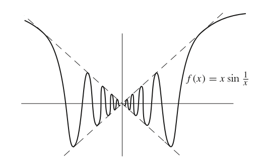

# Mathematical Analysis

Course [home page](./)

## Daily Schedule Term 4

See also [Daily Schedule Term 5](./daily_schedule_term_5.html)

### Week 1 &mdash; Chapter 1 &mdash; Properties of the Real Numbers

* Monday, Jan. 13 &mdash; Reading: Chapter 1, pp. 3-10, postulates (P1)-(P12) for the real numbers &mdash; How to read mathematics: (1) when the author &ldquo;leaves something for the reader&rdquo; stop and do it, and (2) keep a constant eye on what has so far been postulated (as an axiom), defined, or proven (in a theorem, a lemma, or a corollary) and be very careful not to use things that seem obvious but have not yet been postulated, defined, or proven &mdash; In-class: we got started on the end-of-chapter problems
* Thursday, Jan. 16 &mdash; Problem Set 1: Write up Problems 1-3 (which have many subparts) &mdash; For all of the first three problems, it would be best to work in a two-column format where you do the work in the left column, and enumerate which postulates you used in the right column &mdash; To keep the verbosity manageable, let's agree that we don't have to repeatedly note that *a-b* means *a+(-b),* that *a/b* means *a&middot;b-1,* and that *-(a&middot;b)=(-a)&middot;b=a&middot;(-b)* &mdash; Second Reading: Finish Chapter 1, and read the first three pages of Chapter 2 &mdash; In-class: scrutinizing what is meant by equality, proving *(-(-a))=a,* and proving that the additive inverse is unique

### Week 2 &mdash; The Natural Numbers &mdash; Induction &mdash; &Sigma; Notation

* Monday, Jan. 20 &mdash; Problem Set 2: Let's do Problems 5-7 (still in Chapter 1) &mdash; NB: to keep the verbosity of your proofs manageable, you may start using everything you have previously proven (but be sure you aren't using things we haven't proven!) &mdash; As an example, you don't have to keep re-proving *(-(-a))=a* every time you use it, or that the multiplicative inverse (when it exists) and additive inverse are unique, because you know how that goes now &mdash; Reading: Finish Chapter 2 &mdash; In-class: We did inequality proofs
* Thursday, Jan. 23 &mdash; No new reading &mdash; Problem Set 3: Just Problems 1 and 2 from Chapter 2 &mdash; In-class: How about we do a selection of the parts from Problem 3 and 4? &mdash; Are there other end-of-chapter problems that particularly interest you? &mdash; I find lots of them interesting-looking, such  as 13, 14, and 15 &mdash; Avoid problems marked with an asterisk unless you are finding the others to be easy

### Week 3 &mdash; Functions as Sets &mdash; Addition, Multiplication, and Division of Functions &mdash; Composition of Functions

* Monday, Jan. 27 &mdash; Reading: First half of Chapter 3 to p. 44 (ending with commutativity of addition for functions and of multiplication for functions &ldquo;should also present no difficulty&rdquo;) &mdash; Problem Set 4: Problems 1-3 of Chapter 3
* Thursday, Jan. 30 &mdash; Problem Set 5: Problems 5 and 6 (still from Chapter 3) &mdash; Reading: Finish Chapter 3 (but skip the Chapter 3 Appendix) and then continue through to p. 60 of Chapter 4 &mdash; In-class: [Examples of Lagrange Interpolation](./illustrations/LagrangeInterpolation.nb.pdf), open and closed intervals, even and odd functions

### Week 4 &mdash; Graphing in Cartesian and Polar Coordinates &mdash; Vectors

* Monday, Feb. 3 &mdash; Reading: Finish Chapter 4 &mdash; Problem Set 6: Problems 3, 4, 5 and 9 from Chapter 4 &mdash; In-class: We did some more strange functions (stair step and saw tooth), and then started into into Chapter 4 Appendices 1 and 3 (pp. 84-89) on Vectors and Polar Coordinates
* Thursday, Feb. 6 &mdash; Reading: Appendices 1 and 3 of Chapter 4 &mdash; Problem Set 7: Problems 18(v) and 21(a) of Chapter 4 (on pp. 72-73), Problems 1, 2, and 3 of Appendix 1 (on p. 77-78), and Problems 6 and 9(i) of Appendix 3 (on pp. 88-89) &mdash; In-class: As review before the exam, we will do more problems from Chapters 1 to 4

### Week 5 &mdash; Exam 1 &mdash; Start Limits

* Monday, Feb. 10 &mdash; [Exam 1](./exams/Exam1.nb.pdf) on Spivak Chapters 1 to 4, including Appendices 1 and 3 of Chapter 4
* Thursday, Feb. 13 &mdash; Reading: Study Chapter 5 to the bottom of p. 100 &mdash; In-class: [Mapping the square function](./illustrations/SquareMapping.nb.png) and [Cube root limits](./illustrations/CubeRootLimit.nb.pdf)

### Week 6 &mdash; Finish Limits &mdash; Start Continuity

* Monday, Feb. 17 &mdash; Reading: Finish Chapter 5 &mdash; Problem Set 8: Chapter 5, Problems 1-4, 7, and 8

#### Plans for upcoming classes are subject to adjustment, depending especially on the actual pace of the previous classes

* Thursday, Feb. 20 &mdash; Reading: Start Chapter 6 &mdash; Problem Set 9: More problems from Chapter 5

### Week 7 &mdash; Finish Continuity

* Monday, Feb. 24 &mdash; Reading: Finish Chapter 6 &mdash; Problem Set 9: Selected Problems from the end of Chapter 6

## Daily Schedule Term 5

### Week 8

* Monday, March 17
* Thursday, March 20

### Week 9

* Monday, March 24
* Thursday, March 27

### Week 10

* Monday, March 31
* Thursday, April 3
