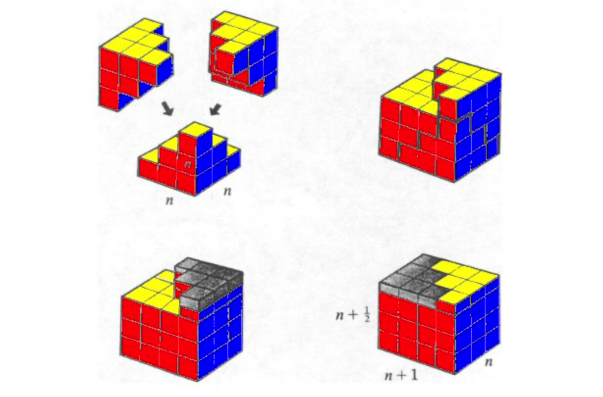

# Mathematical Analysis

Course [home page](./)

## Daily Schedule Term 4

### Week 1 &mdash; Chapter 1 &mdash; Properties of the Real Numbers

* Monday, Jan. 13 &mdash; Reading: Chapter 1, pp. 3-10, postulates (P1)-(P12) for the real numbers &mdash; How to read mathematics: (1) when the author &ldquo;leaves something for the reader&rdquo; stop and do it, and (2) keep a constant eye on what has so far been postulated (as an axiom), defined, or proven (in a theorem, a lemma, or a corollary) and be very careful not to use things that seem obvious but have not yet been postulated, defined, or proven &mdash; In-class: we got started on the end-of-chapter problems
* Thursday, Jan. 16 &mdash; First homework: Write up Problems 1-3 (which have many subparts) &mdash; For all of the first three problems, it would be best to work in a two-column format where you do the work in the left column, and enumerate which postulates you used in the right column &mdash; To keep the verbosity manageable, let's agree that we don't have to repeatedly note that *a-b* means *a+(-b),* that *a/b* means *a&middot;b-1,* and that *-(a&middot;b)=(-a)&middot;b=a&middot;(-b)* &mdash; Second Reading: Finish Chapter 1, and read the first three pages of Chapter 2 &mdash; In-class: scrutinizing what is meant by equality, proving *(-(-a))=a,* and proving that the additive inverse is unique

### Week 2 &mdash; The Natural Numbers &mdash; Induction &mdash; &Sigma; Notation

* Monday, Jan. 20 &mdash; Second homework: Let's do Problems 5-7 (still in Chapter 1) &mdash; NB: to keep the verbosity of your proofs manageable, you may start using everything you have previously proven (but be sure you aren't using things we haven't proven!) &mdash; As an example, you don't have to keep re-proving *(-(-a))=a* every time you use it, or that the multiplicative inverse (when it exists) and additive inverse are unique, because you know how that goes now &mdash; Reading: Finish Chapter 2 &mdash; In-class: We did inequality proofs
* Thursday, Jan. 23 &mdash; No new reading &mdash; Second homework due date extended to Wednesday, Jan. 22 by 12:30pm &mdash; Third homework due at beginning of class: Just Problems 1 and 2 from Chapter 2 &mdash; In-class: How about we do a selection of the parts from Problem 3 and 4? &mdash; Are there other end-of-chapter problems that particularly interest you? &mdash; I find lots of them interesting-looking, such  as 13, 14, and 15 &mdash; Avoid problems marked with an asterisk unless you are finding all the others to be easy

#### A visual proof, drawn with *n*=3, that 3(12+22+...+*n*2)=*n*(*n*+1)(*n*+&frac12;):

### Week 3

#### Plans for upcoming classes are subject to adjustment, depending especially on the actual pace of the previous classes

* Monday, Jan. 27
* Thursday, Jan. 30

### Week 4

* Monday, Feb. 3
* Thursday, Feb. 6

### Week 5

* Monday, Feb. 10
* Thursday, Feb. 13

### Week 6

* Monday, Feb. 17
* Thursday, Feb. 20

### Week 7

* Monday, Feb. 24
* Thursday, Feb. 27 &mdash; No class &mdash; Shakespeare 2.0 Festival Feb. 26-28
